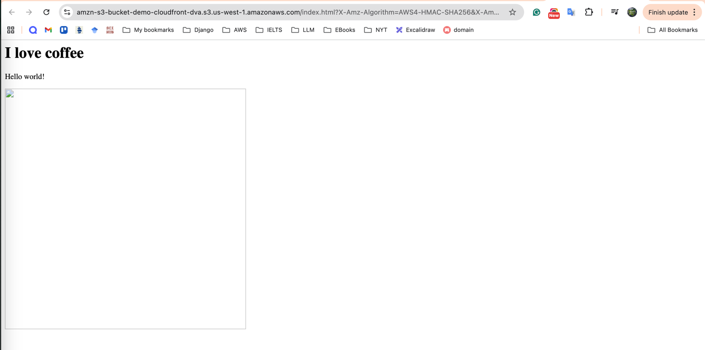
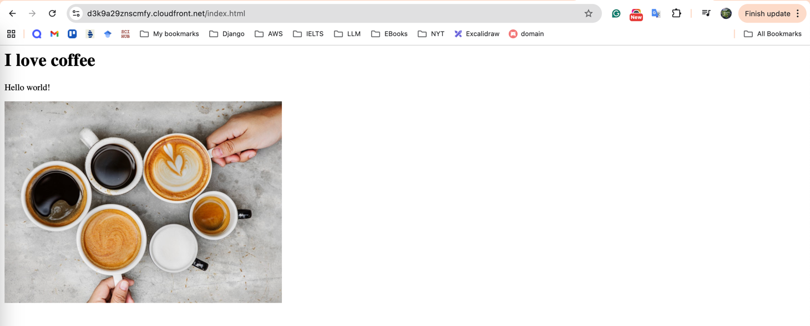

### AWS Lab: CloudFront Distribution with S3 Origin (OAC)

**Ref:** [Udemy DVA-C01 - CloudFront with S3](https://www.udemy.com/course/aws-certified-developer-associate-dva-c01/learn/lecture/19729726#overview)

### Lab Objectives

- [ ]  Deploy a private S3 bucket as an origin.
- [ ]  Create a CloudFront Distribution.
- [ ]  Secure the origin using Origin Access Control (OAC).
- [ ]  Verify content delivery via the CloudFront Edge network.

---

### 1. S3 Origin Setup

1. Create an S3 bucket with default settings (**Block All Public Access** enabled).
2. Upload two files:
    - `index.html` (Ensure it references the image file via a relative path).
    - `image.jpg` (or any image file).
3. Attempt to open the **Object URL** for both files in a private browser tab.
4. Verify that you receive an **Access Denied** error, confirming the bucket is private.

`[Screenshot: S3 Object URL showing Access Denied error]`



---

### 2. CloudFront Distribution Creation

1. Navigate to the **CloudFront Console** and click **Create distribution**.
2. Under **Origin domain**, select your S3 bucket.
3. Under **Origin access**, select **Origin access control settings (recommended)**.
4. Click **Create control setting**, leave defaults, and click **Create**.
5. Set **Viewer protocol policy** to **Redirect HTTP to HTTPS**.
6. Leave all other settings as default and click **Create distribution**.

---

### 3. Update S3 Bucket Policy

1. Once the distribution is created, a banner will appear: "The S3 bucket policy needs to be updated".
2. Click **Copy policy**.
3. Navigate back to your S3 bucket **Permissions** tab.
4. Edit the **Bucket policy** and paste the copied JSON:

```json
{
    "Version": "2012-10-17",
    "Statement": {
        "Sid": "AllowCloudFrontServicePrincipal",
        "Effect": "Allow",
        "Principal": {
            "Service": "cloudfront.amazonaws.com"
        },
        "Action": "s3:GetObject",
        "Resource": "arn:aws:s3:::your-bucket-name/*",
        "Condition": {
            "StringEquals": {
                "AWS:SourceArn": "arn:aws:cloudfront::123456789012:distribution/EDISTRIBUTIONID"
            }
        }
    }
}
```

5. Click **Save changes**.

> ✅ If you check **Allow private S3 bucket access to CloudFront** during distribution creation, CloudFront will automatically add the required bucket policy for you. You can still review it in the bucket’s **Permissions** tab to confirm it matches your distribution ARN.

---

### 4. Verification

1. Wait for the CloudFront Distribution status to change from **Deploying** to **Enabled**.
2. Copy the **Distribution domain name** (e.g., `d111111abcdef8.cloudfront.net`).
3. In your browser, navigate to: `https://<your-distribution-domain>/index.html`.
4. Verify that the HTML page loads and the image is displayed correctly.

`[Screenshot: index.html loading successfully via CloudFront domain]`



---

---

### 🔒 Security: What to Hide

Ensure you redact the following from your documentation:

- **AWS Account ID** inside the Bucket Policy.
- **CloudFront Distribution ID** in the ARN.
- **Full S3 Bucket Name** if it contains personal info.

---

### 🧹 Cleanup

- [ ]  Delete the CloudFront Distribution (requires Disabling first).
- [ ]  Delete the S3 Bucket and its objects.