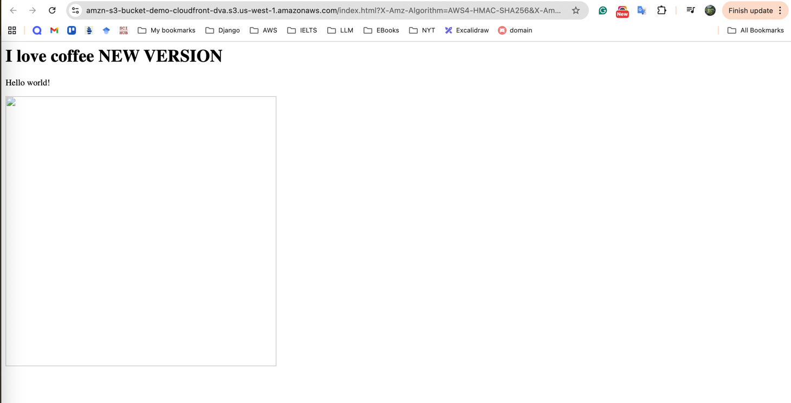
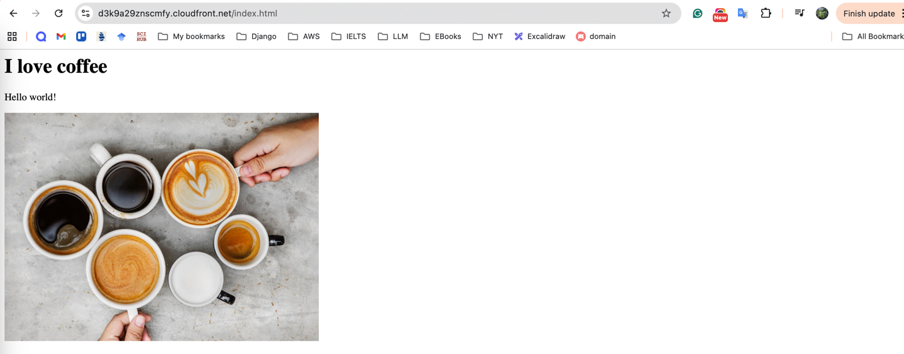
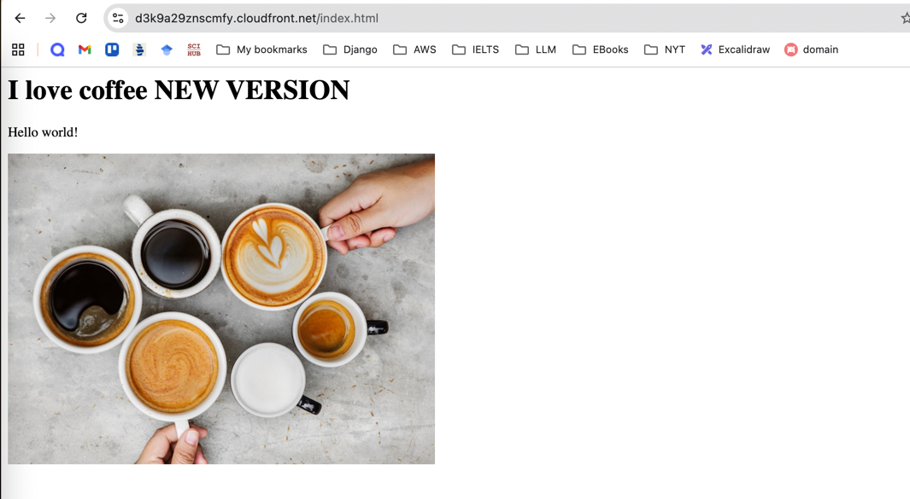

### CloudFront Cache Invalidation

[← Labs index](../README.md) · **Service:** CloudFront · **Level:** Beginner

**Ref:** [Udemy DVA-C01 - CloudFront Invalidation](https://www.udemy.com/course/aws-certified-developer-associate-dva-c01/learn/lecture/36528154#overview)

### Lab Objectives

- [ ]  Modify origin content in S3.
- [ ]  Observe Edge Location caching behavior.
- [ ]  Perform a CloudFront Invalidation.
- [ ]  Verify that updated content is served globally.

---

### 1. Update Origin Content

1. Ensure the setup from the previous **CloudFront with S3** lab is active.
2. Open your local **index.html** and modify the text content (e.g., change "Version 1" to "Version 2").
3. Navigate to the **S3 Console** and upload the new version of **index.html** to your origin bucket.
4. Open the file via the **S3 Object URL** (or use the S3 Static Website endpoint if enabled) to confirm the change is live at the origin.

`[Screenshot: S3 Object URL showing the updated index.html content]`

---

### 2. Observe Caching Behavior

1. Open a browser and navigate to your **CloudFront Distribution Domain Name** (e.g., `https://d111111abcdef8.cloudfront.net/index.html`).
2. Observe that the page still displays the **old content**.
3. This occurs because the Edge Location has not reached the **Time To Live (TTL)** expiration and is serving the cached version of the object.

`[Screenshot: CloudFront URL showing the old index.html content]`

---

### 3. Perform CloudFront Invalidation

1. Navigate to the **CloudFront Console** and select your distribution.
2. Click on the **Invalidations** tab.
3. Click **Create invalidation**.
4. In the **Object paths** box, enter:
    - `/index.html` (to invalidate the specific file) OR
    - `/*` (to clear the entire cache).
5. Click **Create invalidation**.
6. Monitor the status until it changes from **InProgress** to **Completed**.

---

### 4. Verification

1. Return to your browser and refresh the **CloudFront Distribution Domain Name**.
2. Verify that the updated "Version 2" content is now displayed.
3. Because the cache was cleared, CloudFront was forced to fetch the latest version from the S3 origin.

`[Screenshot: CloudFront URL showing the updated index.html content after invalidation]`

---

### 🔒 Security: What to Hide

Ensure you redact the following from your documentation:

- **CloudFront Distribution ID**.
- **AWS Account ID**.
- **S3 Bucket Names**.

---

### 🧹 Cleanup

- [ ]  Delete the Invalidation history (optional).
- [ ]  Disable and delete the CloudFront Distribution.
- [ ]  Delete the S3 bucket and its objects.
