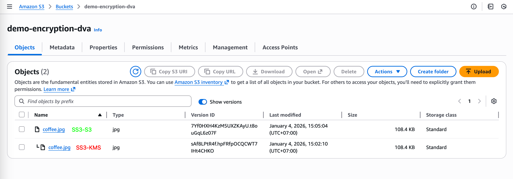

**Ref:** [Udemy DVA-C01 - S3 Encryption](https://www.udemy.com/course/aws-certified-developer-associate-dva-c01/learn/lecture/23743656#lecture-article)

### Lab Objectives

- [ ]  Configure S3 with SSE-S3 and Versioning.
- [ ]  Transition object encryption to SSE-KMS.

---

### 1. Bucket Creation and Configuration

1. Navigate to the **S3 Console** and click **Create bucket**.
2. Provide a unique **Bucket name**.
3. Set **Bucket Versioning** to **Enable**.
4. Under **Default encryption**, select **Server-side encryption with Amazon S3 managed keys (SSE-S3)**.
5. Click **Create bucket**.

`[Screenshot: S3 configuration showing Versioning and SSE-S3 encryption enabled]`

---

### 2. Initial Object Upload

1. Open the bucket and click **Upload** to add a test file.
2. In the **Properties** section of the upload, confirm **Server-side encryption** is set to **Use bucket settings**.
3. Click **Upload**.
4. Select the file and verify under **Encryption properties** that the method is **SSE-S3**.

---

### 3. Modifying Encryption to SSE-KMS

1. Open the **Object properties** of the uploaded file.
2. Under **Server-side encryption settings**, click **Edit**.
3. Select **AWS Key Management Service key (SSE-KMS)**.
4. Choose the default AWS managed key (**aws/s3**).
5. Click **Save changes**.
6. Verify the object now displays a **KMS key ARN** in the properties tab.

`[Screenshot: Updated Object properties displaying SSE-KMS encryption]`

---

### 🔒 Security: What to Hide

Ensure you redact the following from your documentation:

- **AWS Account ID** (found in navigation bar and ARNs).
- **IAM Usernames**.
- **KMS Key IDs/ARNs**.

---

### 🧹 Cleanup

- [ ]  Delete all objects and bucket.