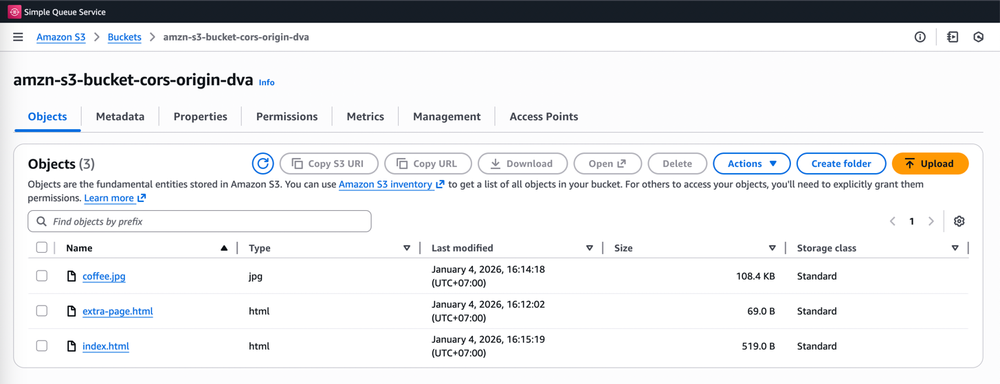
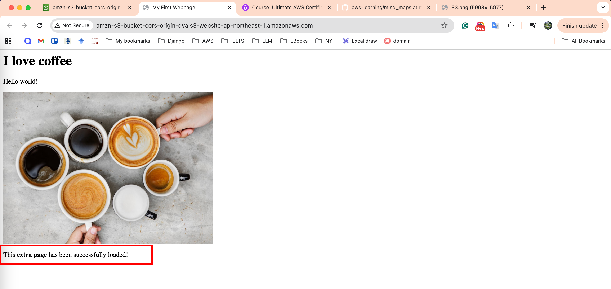
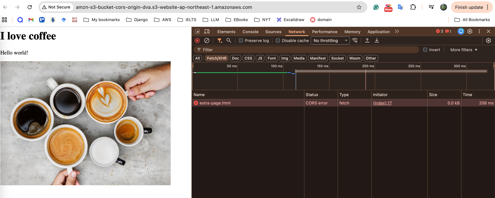
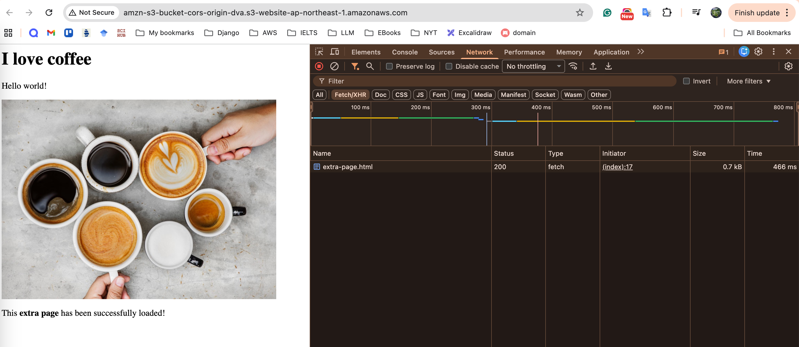

### AWS Lab: S3 Cross-Origin Resource Sharing (CORS)

**Ref:** [Udemy DVA-C01 - S3 CORS](https://www.udemy.com/course/aws-certified-developer-associate-dva-c01/learn/lecture/19729172#lecture-article)

### Lab Objectives

- [ ]  Configure S3 Static Website Hosting across two buckets.
- [ ]  Observe CORS errors when performing cross-origin fetches.
- [ ]  Resolve errors by implementing a CORS policy.

---

### 1. Primary Bucket Setup

1. Create an S3 bucket (e.g., **bucket-primary**) and disable **Block All Public Access**.
2. Under **Properties**, enable **Static website hosting** and specify **index.html** as the index document.
3. Under **Permissions**, add a **Bucket Policy** to allow public **s3:GetObject** access.
4. Upload **index.html** and **extra-page.html**.
5. Ensure **index.html** contains a script to fetch **extra-page.html** using a relative path.
6. Open the **Bucket Website Endpoint** and verify the page loads successfully.

`[Screenshot: Successful same-origin fetch in browser console]`






---

### 2. Secondary Bucket Setup (Cross-Origin)

1. Create a second S3 bucket in a **different region** (e.g., **bucket-secondary**).
2. Enable **Static website hosting** and disable **Block All Public Access**.
3. Apply a public read **Bucket Policy**.
4. Upload **extra-page.html** to this second bucket.
5. Note the **Bucket Website Endpoint** URL of this second bucket.

---

### 3. Triggering CORS Error

1. Edit the local **index.html** file.
2. Change the fetch command to point to the full URL of **extra-page.html** in the **secondary bucket**.
3. Upload the updated **index.html** to the **primary bucket**.
4. Access the primary bucket endpoint.
5. Open **Browser Developer Tools** (F12) and observe the console error: **Access to fetch at ... has been blocked by CORS policy**.

`[Screenshot: Browser console showing Red CORS error]`



---

### 4. Implementing CORS Policy

1. Navigate to the **secondary bucket** in the S3 Console.
2. Go to the **Permissions** tab and scroll to **Cross-origin resource sharing (CORS)**.
3. Click **Edit** and paste the following configuration (replace the URL with your primary bucket endpoint):

```json
[
    {
        "AllowedHeaders": ["Authorization"],
        "AllowedMethods": ["GET"],
        "AllowedOrigins": ["<http://your-primary-bucket-endpoint>"],
        "ExposeHeaders": []
    }
]
```

5. Click **Save changes**.
6. Refresh the primary bucket website and verify the fetch now succeeds.

`[Screenshot: Successful cross-origin fetch in browser console]`



---

### 🔒 Security: What to Hide

Ensure you redact the following from your documentation:

- **AWS Account ID** (found in navigation bar and policy ARNs).
- **IAM Usernames**.
- **Full Bucket Names** if they contain private identifiers.

---

### 🧹 Cleanup

- [ ]  Delete objects and buckets in both regions.