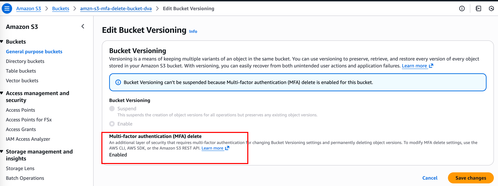
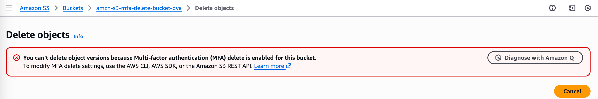

### AWS Lab: S3 MFA Delete Configuration

[← Labs index](../README.md) · **Service:** S3 · **Level:** Beginner

**Ref:** [Udemy DVA-C01 - MFA Delete](https://www.udemy.com/course/aws-certified-developer-associate-dva-c01/learn/lecture/23743660#lecture-article)

### Lab Objectives

- [ ]  Enable S3 Versioning and MFA Delete.
- [ ]  Configure AWS CLI with Root Account credentials.
- [ ]  Verify that deletions fail without MFA tokens.
- [ ]  Disable MFA Delete and verify standard deletion.

---

### 1. Bucket Preparation

1. Navigate to the **S3 Console** and click **Create bucket**.
2. Provide a unique **Bucket name**.
3. Under **Bucket Versioning**, select **Enable**.
4. Click **Create bucket**.
5. Upload a sample file to this bucket to serve as a test object.

---

### 2. Root Access and CLI Setup

1. Log in to the AWS Console as the **Root User**.
2. Navigate to **IAM** -> **My Security Credentials**.
3. Create a new **Access Key** (Access Key ID and Secret Access Key).
4. Open your local terminal and run `aws configure --profile root-mfa`.
5. Provide the Root credentials and set the default region.
6. Note your **MFA Device ARN** from the IAM security credentials page (e.g., `arn:aws:iam::123456789012:mfa/root-account-mfa-device`).

---

### 3. Enabling MFA Delete

1. MFA Delete can only be enabled via the AWS CLI.
2. Execute the following command to enable the feature:

```bash
aws s3api put-bucket-versioning \\
    --bucket YOUR_BUCKET_NAME \\
    --versioning-configuration Status=Enabled,MFADelete=Enabled \\
    --mfa "YOUR_MFA_DEVICE_ARN MFA_CODE" \\
    --profile root-mfa
```

3. Verify the status by running: `aws s3api get-bucket-versioning --bucket YOUR_BUCKET_NAME`.

`[Screenshot: Terminal or S3 console output showing MFADelete enabled]`



---

### 4. Testing Deletion Restrictions

1. Attempt to delete the test object via the **S3 Console** or **CLI** without providing an MFA code.
2. Observe the failure or notice that the version is not permanently removed.
3. Attempt to disable versioning via the console; notice the option is restricted due to MFA Delete being active.

`[Screenshot: Deletetion failure or console message stating versioning cannot be disabled]`



---

### 5. Disabling MFA Delete

1. To return the bucket to normal, execute the disable command:

    ```bash
    aws s3api put-bucket-versioning \
    --bucket YOUR_BUCKET_NAME \
    --versioning-configuration Status=Enabled,MFADelete=Disabled \
    --mfa "YOUR_MFA_DEVICE_ARN MFA_CODE" \
    --profile root-mfa
    ```

2. Test deleting the object again. The deletion should now proceed successfully without an MFA prompt.

---

### 🔒 Security: What to Hide

Ensure you redact the following from your documentation:

- **Root Access Key ID** and **Secret Access Key**.
- **AWS Account ID** and **MFA Device ARN**.
- **MFA Token Codes** used in terminal commands.

---

### 🧹 Cleanup

- [ ]  Delete test objects and the S3 bucket.
- [ ]  Deactivate and delete the Root Access Key.
- [ ]  Remove the CLI profile from `~/.aws/credentials`.
